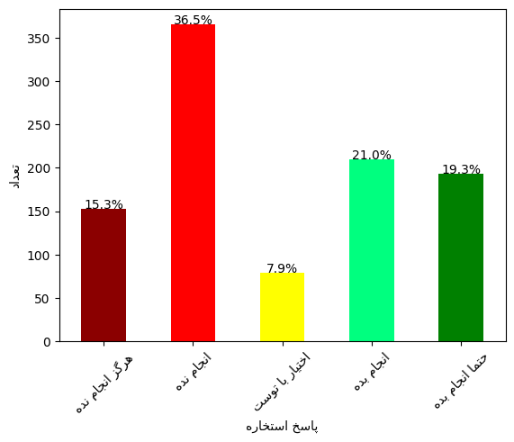

# Estekhare Analyzor

This project is designed to test if the results of [estekhare](https://en.wikipedia.org/wiki/Estekhare) are fair or if they exhibit any biases.

## Data Source
We extract data from the [Aviny](https://old.aviny.com/quran/estekhareh/index.aspx) website.

## Methodology
1. **Data Extraction**: We first extract data from the [Aviny](https://old.aviny.com/quran/estekhareh/index.aspx) website. This involves scraping the website to gather the necessary information about estekhare.

2. **Data Collection**: We use a web scraper built with Selenium to collect random estekhare results. This process is repeated 1000 times to ensure a significant sample size for analysis.

3. **Data Analysis**: After collecting the data, we analyze the results to determine if there are any biases or patterns in the estekhare outcomes. This involves statistical analysis and visualization to interpret the data effectively.

## Results

# Outcome Prediction Analysis

This project examines the outcome prediction tendencies of a certain source. We analyze whether the source shows bias toward negative predictions and test its behavior using 1,000 random simulations.

## Overview

- **Objective**: To assess the tendencies of the prediction source by analyzing outcome categories and testing its random distribution.
- **Key Findings**: The source displays a bias toward negative predictions, showing a preference for bad results more often than good ones. Based on the simulations, we observe the following outcome distribution:
  - **Bad** outcome: ~51%
  - **Good** outcome: ~40%
  - **Neutral** outcome: ~9%

## Data and Analysis

### 1. Category Distribution

The distribution of outcome categories is visualized in the histogram below. This chart highlights the source's general tendency toward indicating "bad" outcomes.

### 2. Simulation Test Results

We conducted 1,000 tests to further understand the source's prediction behavior. The test results suggest that the source uses a uniform random distribution for its predictions. However, there is a notable tendency for it to predict "bad" outcomes slightly more frequently than "good" or "neutral" outcomes.

### Summary of Results

The results from our analysis reveal that the prediction source is not completely balanced in its outcomes. The distribution is as follows:
- **Bad Outcomes**: 51% (the most frequent prediction category)
- **Good Outcomes**: 40%
- **Neutral Outcomes**: 9%

The slight skew toward bad outcomes may have implications for applications using this predictor, especially in scenarios where a fair distribution of outcomes is desired.

## Conclusion

This analysis suggests that while the predictor is based on a uniform random distribution, it has a slight tendency to favor "bad" outcomes. These findings could inform further adjustments to the source’s algorithm if a more balanced prediction model is preferred.

